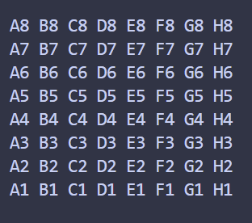

# ollebjor-chess
Hej och välkommen till olles jättecoola tjackmotor. Här är en snabb rundown:
### 1. Game structet
Game structet är det enda du behöver använda. `let game = Game::new();` Initialisar ett nytt bräde med pjäser uppställda.

### 2. Flytta pjäser jao
När du sedan vill flytta en pjäs så kan du anropa metoden `game.move_piece(from, to);` 

#### 2.1 BoardPosition
Man anger positionen med structet `BoardPosition`. Det kan skapas genom `BoardPosition::new(File::D, Rank::Four)` till exempel. Du får då en position på brädet som är `D4`.

#### 2.2 File & Rank enums


Detta är notationen för hur planen ser ut! Använd enumsen `File` och `Rank` för att hitta en position!
* `File` ranges from `A..=H` (these are the columns)
* `Rank` ranges from `1..=8` (these are the rows)

### 3. Game state och sånt
`game.move_piece(from, to) -> Result<GameState, ChessError>` returns a result that is either a `ChessError` enum (se the docs for explanation of each variant) or a GameState. 

### 4. Reacting to the game state
You can always read the current game state with `game.state`. No method will return a `GameState` enum without first changing the internal game state.

### 5. Example

Using what we've learnt from this <span style="color:orange">*AMAZING*</span> tutorial, we can now create a game!

```rust

let game: Game = Game::new();

if let Ok(new_state) = game.move_piece(BoardPosition::new(File::C, Rank::Two),BoardPosition::new(File::C, Rank::Three)){
   if let GameState::Promotion(position) = new_state {
      /*...
      do stuff to figure out the promoted_piece
      ...*/
      game.promote_piece(promoted_piece);
   }
} else {
   println!("error!");
}

```

### backlog
* [ ] Implement promotion (WIP)
* [ ] Stalemate
* [ ] Checkmate